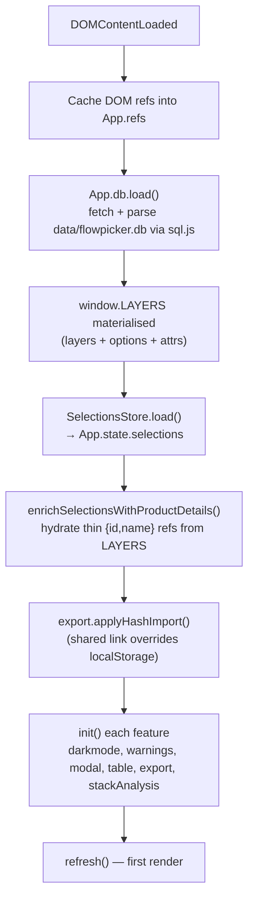
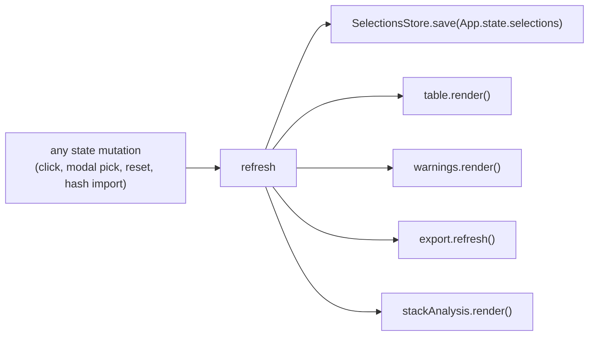
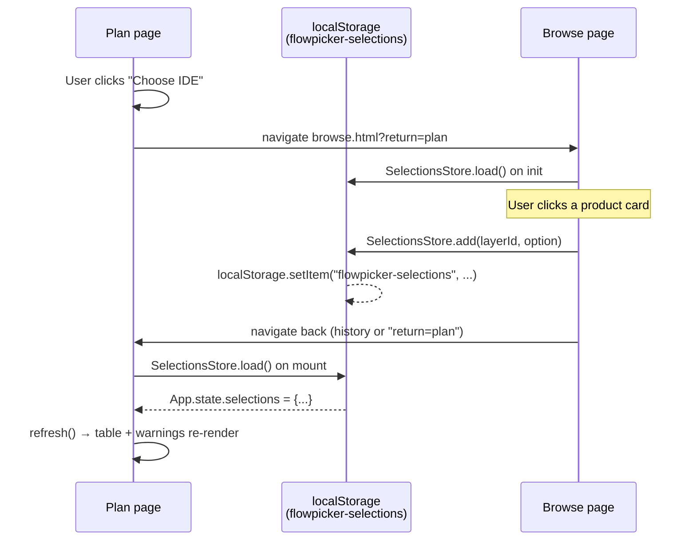
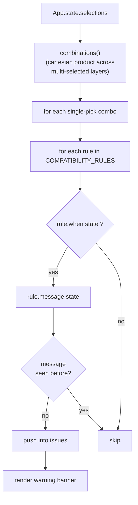

# Flowpicker Architecture

A new-contributor guide to **how the program works** — what runs when, what talks to what, and where state lives. If you've cloned the repo and want to find your bearings before changing anything, start here.

---

## 1. What Flowpicker is

Flowpicker is an **AI-coding-stack builder**. The user picks one or more products per layer — IDE, LLM, Integration, Context/RAG, Agent, Others — and Flowpicker shows them:

- compatibility warnings (e.g. "Cursor built-in only works inside the Cursor IDE"),
- an estimated monthly cost and setup-complexity summary,
- a side-by-side spec table.

They can then share a permalink, export the stack (Markdown / CSV / JSON / text), or save it under their account. The site is live at **flowpicker.xyz**.

---

## 2. Tech stack at a glance

| Concern | Choice |
|---|---|
| Frontend | Plain HTML / CSS / ES2020 — **no framework, no build step** |
| Product data | SQLite-in-the-browser via [sql.js](https://sql.js.org) (WASM) |
| Runtime state | `window.App` namespace |
| Durable state | `localStorage` (wrapped by `SelectionsStore`) |
| Unit tests | [Vitest](https://vitest.dev) |
| E2E tests | [Playwright](https://playwright.dev) |
| Hosting | Static site on GitHub Pages (`CNAME` → flowpicker.xyz) |
| Optional backend | Node + `better-sqlite3` ([server.js](../server.js)) for the templates API |

Because there is no build step, **script-tag order in the HTML is the dependency graph**. Features must load before [src/main.js](../src/main.js).

---

## 3. Repo map

```
flowpicker/
├── index.html                  Plan page (main stack-builder table)
├── browse.html                 Catalog with layer-scoped filters
├── templates.html              Pre-built starter stacks
├── saved.html                  User's saved stacks
├── compare.html                Dynamic comparator
├── best/, compare/             SEO landing pages (statically generated)
│
├── data/
│   ├── flowpicker.db           ← SOURCE OF TRUTH for all products
│   ├── rules.js                Compatibility predicates (COMPATIBILITY_RULES)
│   ├── attribute-labels.js     Display labels for product attributes
│   └── templates.js            Pre-built stack definitions
│
├── vendor/
│   ├── sql-wasm.js             sql.js loader
│   └── sql-wasm.wasm           SQLite compiled to WASM
│
├── src/
│   ├── main.js                 Bootstrap + refresh() orchestrator
│   ├── db.js                   sql.js loader → window.LAYERS
│   ├── styles/                 Tokens + base CSS
│   └── features/               One folder per feature module
│       ├── table/              Plan-page table renderer
│       ├── warnings/           Rule evaluator + banner
│       ├── modal/              Layer picker modal
│       ├── browse-filters/     Browse page: filters + detail panel
│       ├── selections-store/   localStorage persistence (cross-page contract)
│       ├── export/             Share-link encode/decode + export formats
│       ├── stack-analysis/     Cost + setup-complexity summary
│       ├── saved-flows/        Per-user saved stacks
│       ├── templates/          Template gallery renderer
│       ├── darkmode/           Theme toggle
│       ├── browse-menu/        Layer navigation menu
│       └── auth/               Sign-in modal + user context
│
├── tools/                      Static-page + sitemap generators
├── tests/                      Vitest + Playwright suites
├── server.js                   Optional Node API (templates)
└── package.json
```

---

## 4. The three global rails

Almost every feature reads or writes one of these three things. Internalising this is the fastest route to understanding the codebase.

1. **`window.App`** — declared in [src/main.js](../src/main.js):

   ```js
   const App = {
     state: { selections: {}, activeLayerId: null },
     refs: {},        // cached DOM nodes
     features: {},    // feature modules register themselves here
   };
   ```

2. **`window.LAYERS`** — the materialised product catalogue. Built once by [src/db.js](../src/db.js) from `data/flowpicker.db`. Read synchronously everywhere after bootstrap.

3. **`localStorage`** — the cross-page contract. Owned by [src/features/selections-store/selections-store.js](../src/features/selections-store/selections-store.js) under the key `flowpicker-selections`. This is how the Browse page tells the Plan page about a click.

> **Mental model:** features never call each other directly. They mutate `App.state` (or `localStorage`) and then ask `refresh()` to re-render everyone.

---

## 5. Bootstrap sequence (Plan page)

What happens between `<script src="src/main.js">` parsing and the first paint of the table. Source: [src/main.js:18-108](../src/main.js#L18-L108).



**Why the enrichment step exists.** Templates ([data/templates.js](../data/templates.js)) store selections as just `{ id, name }` to keep the file small. The rest of the app expects full product objects (with `os`, `pricing`, `contextWindow`, etc.) so that the table cells and warning rules can read attributes off them. `enrichSelectionsWithProductDetails` looks each thin ref up in `LAYERS` and swaps in the full object. Without this, a stack loaded from a template would render with blank specs.

**Why hash import beats localStorage.** A shared link is an explicit user intent ("show me *this* stack"). If we let localStorage win, opening a friend's share link in a tab where you already had selections would silently ignore the link. `applyHashImport()` runs after `SelectionsStore.load()` and overwrites the selections if a hash is present.

---

## 6. The `refresh()` cycle

The closest thing Flowpicker has to a reconciler. Source: [src/main.js:110-118](../src/main.js#L110-L118).



Every mutation funnels through `refresh()`. Features re-derive everything from `App.state` on each call — there is no diffing and no observer pattern. This is fine because:

- the table is at most ~10 rows,
- `evaluateRules()` is cheap (a handful of predicates over a handful of picks),
- and there is no animation that re-rendering would interrupt.

If you add a feature that mutates state, **call `refresh()` after the mutation**. Don't try to update the DOM yourself.

---

## 7. Cross-page selection handoff

The flow that surprises most new contributors: how a click on Browse ends up reflected on Plan, when the two pages share **zero in-memory state**.



The only contract between the two pages is the **shape of the localStorage payload** owned by [src/features/selections-store/selections-store.js](../src/features/selections-store/selections-store.js):

```js
{
  ide:         [{ id: 'cursor', name: 'Cursor', os: 'macOS, Windows', ... }],
  llm:         [{ id: 'claude-sonnet', name: 'Claude Sonnet 4.6', ... }],
  integration: [{ id: 'cursor-built', name: 'Cursor built-in', ... }],
  // ...
}
```

The key is **`flowpicker-selections`**. If you ever change the schema, bump it (e.g. `flowpicker-selections-v2`) so stale localStorage from old tabs doesn't crash the renderer.

---

## 8. Compatibility rules engine

The warnings banner is produced by `evaluateRules()` in [src/features/warnings/warnings.js](../src/features/warnings/warnings.js), driven by `COMPATIBILITY_RULES` in [data/rules.js](../data/rules.js).



A rule is just `{ id, when(state), message(state) }`. `state` is one **single-pick combination** (each layer collapsed to one option), so rules can write straightforward checks like:

```js
{
  id: 'cursor-built-needs-cursor',
  when:    s => s.integration?.id === 'cursor-built' && s.ide && s.ide.id !== 'cursor',
  message: s => `${s.integration.name} only runs inside the Cursor editor — your IDE is ${s.ide.name}.`,
}
```

Why the combinations step? A layer can hold **multiple picks** (e.g. two LLMs), and a rule about "the user's LLM" must run against each one. `combinations()` expands `{ llm: [a, b] }` into two states `{ llm: a }` and `{ llm: b }`, runs every rule against each, then deduplicates messages.

There is also `wouldConflict(layerId, option)` — used by the picker modal and Browse cards to show "this would create a conflict" before the user commits. It speculatively adds the option to the state and checks whether the issue count goes up.

**To add a rule:** append an object to `COMPATIBILITY_RULES` in [data/rules.js](../data/rules.js). No other file needs to change.

---

## 9. Data model

### `LAYERS` (built by [src/db.js](../src/db.js))

```js
[
  {
    id: 'ide',
    name: 'IDE / Editor',
    optional: false,           // can the stack work without this layer?
    chipKeys: ['os', 'pricing', 'interface'],   // attrs to show as badges
    options: [
      { id: 'cursor',  name: 'Cursor',  os: 'macOS, Windows', pricing: 'Paid', ... },
      { id: 'vscode',  name: 'VS Code', os: 'macOS, Windows, Linux', ... },
      // ...
    ],
  },
  // llm, integration, context, agent, others ...
]
```

Per-layer attribute keys vary (LLMs have `contextWindow`, `priceInput`, `sweBench`; IDEs have `os`, `interface`, `aiIntegration`; etc.). Features that need a specific attribute should defensively check it exists — there is no schema enforcement.

### `App.state`

```js
{
  selections: { [layerId]: [option, ...] },
  activeLayerId: null,              // currently open picker modal, if any
  usageProfile: 'chat',             // for stackAnalysis
  teamSize: 'solo',
  repoSize: 'medium',
  analysisBaseline: null,
}
```

### SQLite schema (`data/flowpicker.db`)

| Table | Columns | Purpose |
|---|---|---|
| `layers` | id, name, optional, position | The six layer rows |
| `options` | layer_id, id, name, position | Products inside each layer |
| `option_attrs` | layer_id, option_id, key, value | Key-value attributes per product |
| `layer_chip_keys` | layer_id, key, position | Which attrs appear as chips in the UI |

Edit with [DB Browser for SQLite](https://sqlitebrowser.org) or the `sqlite3` CLI. Save the file, reload the browser — the page re-fetches `data/flowpicker.db` on every load.

---

## 10. Feature module convention

Every folder under `src/features/` follows the same pattern. To add one (`coolthing`):

1. Create `src/features/coolthing/coolthing.js`:

   ```js
   App.features.coolthing = (() => {
     function init() {
       // wire DOM events, read App.refs, etc.
     }
     function render() {
       // re-derive from App.state and update the DOM
     }
     return { init, render };
   })();
   ```

2. Add a `<script src="src/features/coolthing/coolthing.js">` to whichever HTML page hosts the feature — **before** `src/main.js`.
3. Call `App.features.coolthing.init()` from the bootstrap block in [src/main.js](../src/main.js).
4. If the feature mutates `App.state`, call `refresh()` after mutating so other features re-render.
5. If the feature has its own re-render, add a call to it inside the `refresh()` function.

CSS lives next to the JS as `coolthing.css` and is linked from the HTML the same way.

---

## 11. Share-link & export pipeline

### Share link

`export.buildShareUrl()` encodes `App.state.selections` into a URL hash. For a stack with Cursor + Claude Sonnet, the result looks like:

```
https://flowpicker.xyz/index.html#s=ide:cursor;llm:claude-sonnet
```

Multiple picks within one layer are comma-separated: `llm:claude-sonnet,claude-opus`. Layers are semicolon-separated. The hash key is `s`.

On load, `export.applyHashImport()` decodes the hash and writes into `App.state.selections` **before the first render**, so the table comes up with the shared selections in place. The localStorage value gets overwritten by the subsequent `refresh()` → `SelectionsStore.save()` call, which is intentional: opening a shared link is an act of replacement, not a merge.

### Export formats

`runExport(format)` is wired to the toolbar's export menu. Supported formats: `markdown`, `csv`, `json`, `text`. Each produces a file mirroring the Plan-page table — useful for pasting into a doc or feeding to a tool.

---

## 12. Saved flows & auth

[src/features/saved-flows/saved-flows.js](../src/features/saved-flows/saved-flows.js) persists saved stacks scoped per user. The shape:

```js
{
  "amil@example.com": [
    { id: 'abc123', name: 'My agentic setup', selections: { ... }, savedAt: '...' },
    // ...
  ],
  "__local__": [ /* anonymous saves */ ]
}
```

[src/features/auth/](../src/features/auth/) provides a sign-in modal that sets the current email. When signed in, saved flows are stored under that email key; otherwise they go under `__local__`. There is currently **no server-side auth** — this is local-only namespacing, with backend work planned.

---

## 13. Running locally

You need a static HTTP server because sql.js uses `fetch()` to load `data/flowpicker.db` and `vendor/sql-wasm.wasm` — opening `index.html` via `file://` will not work.

| Task | Command |
|---|---|
| Serve the site | `npm run serve` (http-server on port 8000) |
| Templates API (optional) | `npm run server` (Node + better-sqlite3) |
| Both at once | `npm run dev` |
| Unit tests | `npm test` (Vitest) |
| Unit tests in watch | `npm run test:watch` |
| E2E tests | `npm run test:e2e` (install browsers first: `npm run test:e2e:install`) |
| Unit + E2E | `npm run test:all` |
| Rebuild static SEO pages | `npm run build:pages` |
| Rebuild sitemap | `npm run build:sitemap` |

Editing the product catalogue: open `data/flowpicker.db` in DB Browser for SQLite, make your edits, save, reload the browser.

---

## 14. Troubleshooting / gotchas

- **"Failed to load product database"** — you're not serving over HTTP, or `data/flowpicker.db` is missing. Run `npm run serve`.
- **Selections from Browse don't appear on Plan** — open DevTools → Application → Local Storage and inspect the `flowpicker-selections` key. If it's there but the table is empty, the enrichment step in [src/main.js:56-88](../src/main.js#L56-L88) probably couldn't find the option in `LAYERS` (renamed or deleted product ID).
- **A warning isn't firing** — your rule's `when()` predicate is returning false. Remember: `s` is one *single-pick combination*, so `s.ide` is an option object (or `undefined`), not an array. Use optional chaining: `s.ide?.id === 'cursor'`.
- **Dark mode "stuck"** — the toggle is persisted in `localStorage` under `flowpicker-dark-mode`. Clear it to reset.
- **Script load order** — if a feature throws "App is not defined" or "App.features.X is undefined", check your `<script>` tags. Order must be: `vendor/sql-wasm.js` → `src/db.js` → all feature scripts → `src/main.js`.
- **Stale shared link** — if a share link references a product ID that has since been renamed, the enrichment step silently falls back to the thin `{id,name}` ref and the row will render with no specs. Search the DB for the old ID before renaming.

---

## Where to look next

| You want to... | Start in |
|---|---|
| Add or edit a product | [data/flowpicker.db](../data/flowpicker.db) (DB Browser) |
| Add a compatibility rule | [data/rules.js](../data/rules.js) |
| Change how a layer renders | [src/features/table/table.js](../src/features/table/table.js) |
| Change Browse filters | [src/features/browse-filters/browse-filters.js](../src/features/browse-filters/browse-filters.js) |
| Adjust cost / setup math | [src/features/stack-analysis/stack-analysis.js](../src/features/stack-analysis/stack-analysis.js) |
| Change the share-link format | [src/features/export/export.js](../src/features/export/export.js) |
| Add a feature module | Read section 10, copy a small existing folder like `darkmode/` |
| Understand bootstrap | [src/main.js](../src/main.js) |
